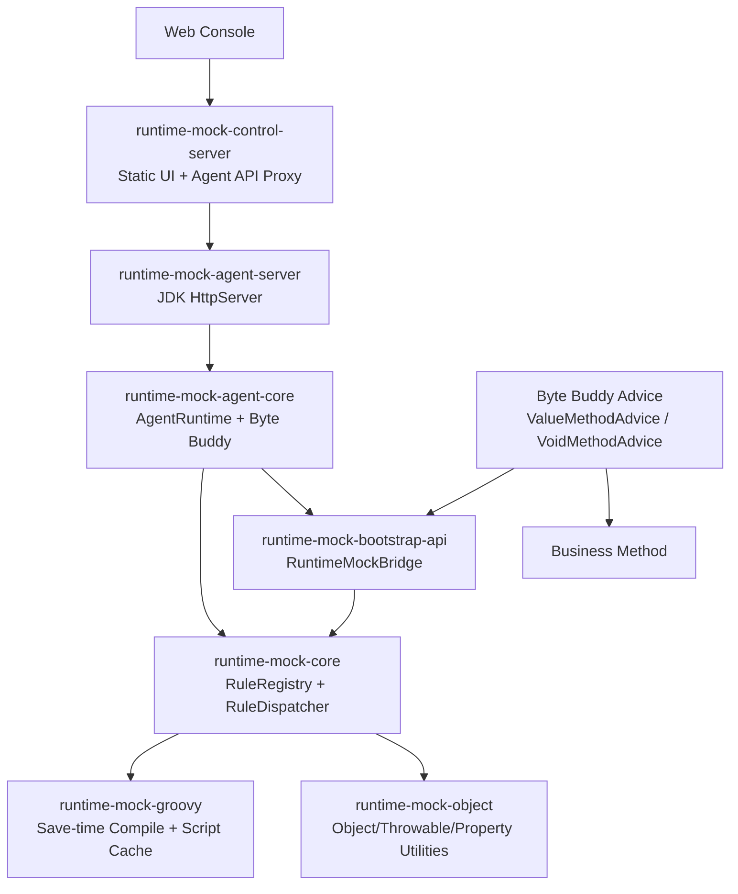

# Java 运行时 Mock 与故障注入系统

## 实现版三合一文档

本文档基于当前 `runtime-mock` 工程的实际代码重构原始需求、技术设计与任务拆解。它不是纯概念方案，而是当前实现的基线说明，包含已完成能力、实际架构、接口协议、验收覆盖、运行方式、限制以及生产级 100% 完成所需的后续工作。

文档状态：

- 当前工程版本：`0.1.0-SNAPSHOT`
- 当前实现口径：MVP 已完成，生产化骨架部分完成
- JDK 基线：Bootstrap/Bridge Java 8 字节码，Modern Core Java 17
- 构建工具：Maven 多模块
- 核心技术：Java Instrumentation、Byte Buddy、Groovy、JDK HttpServer、Jackson

---

# 一、产品目标

Runtime Mock 是一个面向 Java 进程的运行时 Mock 与故障注入系统。它通过 Java Agent 在目标 JVM 内部对指定业务方法进行字节码增强，并在方法调用的 BEFORE、RETURN、THROWS 阶段执行预编译 Groovy 脚本，从而完成参数修改、提前返回、异常注入、返回值替换、异常降级等能力。

目标能力：

- 在不修改业务代码、不重启或少重启目标应用的情况下，对指定方法发布 Mock 规则。
- 支持启动时 `-javaagent` 与运行中动态 Attach。
- 支持精确到 class name、classLoaderId、method name、method descriptor 的方法匹配。
- 支持实例方法、静态方法、public/private 方法、基本类型、对象类型、void 方法。
- 支持规则热更新、启用、禁用、删除、TTL、最大命中次数、命中比例、全局禁用和 reset-all。
- 脚本保存或发布时编译，业务热路径不动态编译 Groovy。
- Agent 内部错误默认 fail-open，不污染业务执行。
- 提供 Agent 本地 HTTP API 和轻量控制台，方便规则发布和观测。

当前工程已从可运行、可测试、可演示的 MVP 基线推进到生产化骨架阶段。Agent thin bootstrap/core-modern 隔离、`/v1` 本地 API、Ops CLI、Groovy AST 安全、控制面状态机/审计哈希链、Sidecar 脱敏/tokenization/AES-GCM WAL 底座已实现。生产级完整产品仍需补齐 Spring Boot 控制面、PostgreSQL/Flyway、OIDC/RBAC/审批、Sidecar gRPC mTLS、完整 Record/Dataset/Replay、自动回滚和供应链安全。

---

# 二、当前工程结构

项目主目录：

```text
runtime-mock
├── pom.xml
├── README.md
├── Java 运行时 Mock 与故障注入系统 - 实现版三合一文档.md
├── runtime-mock-bootstrap-api
├── runtime-mock-api
├── runtime-mock-object
├── runtime-mock-groovy
├── runtime-mock-core
├── runtime-mock-agent-core
├── runtime-mock-agent-server
├── runtime-mock-agent-core-modern
├── runtime-mock-agent-bootstrap
├── runtime-mock-attach-cli
├── runtime-mock-ops
├── runtime-mock-sidecar
├── runtime-mock-web
├── runtime-mock-control-server
├── runtime-mock-demo
└── runtime-mock-integration-tests
```

模块职责：

| 模块 | 职责 |
| --- | --- |
| `runtime-mock-bootstrap-api` | Bootstrap 可见的极小 Bridge API，提供 `RuntimeMockBridge`、`BridgeDispatcher`、`EnterResult`、`ExitResult`、`BridgeAction` |
| `runtime-mock-api` | 对外领域模型和脚本 API，包含 `MockRule`、`MethodSelector`、`MockDecision`、`InvokePhase`、`InvocationContext`、`MockApi` |
| `runtime-mock-object` | JSON 转换、对象创建、异常创建、属性路径读写 |
| `runtime-mock-groovy` | Groovy 保存时编译、脚本 ClassLoader、脚本基类、AST 安全策略、脚本执行 |
| `runtime-mock-core` | 规则注册、不可变 RuleSet、调度器、类型校验、采样、命中限制、重入保护、日志限制 |
| `runtime-mock-agent-core` | Agent 运行时、Byte Buddy Transformer、Advice、类搜索、方法搜索、指标与事件 |
| `runtime-mock-agent-server` | Agent 本地 HTTP API，基于 JDK `HttpServer` |
| `runtime-mock-agent-core-modern` | JDK 17/21 modern core shaded assembly |
| `runtime-mock-agent-bootstrap` | Java 8 thin bootstrap，`premain`、`agentmain`、参数解析、隔离 ClassLoader 加载 Core |
| `runtime-mock-attach-cli` | 动态 Attach 命令行工具 |
| `runtime-mock-ops` | 本机 emergency operations CLI |
| `runtime-mock-sidecar` | 录制数据安全底座：脱敏、稳定 tokenization、AES-GCM 加密 WAL |
| `runtime-mock-web` | 静态 Web 控制台资源 |
| `runtime-mock-control-server` | 控制台静态资源服务、Agent API 代理、早期 `/api/v1` 控制面资源 |
| `runtime-mock-demo` | Spring Boot 兼容 Demo 业务对象与 `OrderService` |
| `runtime-mock-integration-tests` | JVM 集成测试，覆盖核心验收场景 |

---

# 三、总体架构

当前实现采用控制端、Agent HTTP Server、Agent Core、Bootstrap Bridge、业务方法 Advice 的分层架构。



核心调用链：

1. 用户在控制台选择 JVM、类、方法和 Groovy 脚本。
2. 控制台通过 `runtime-mock-control-server` 代理请求到 Agent HTTP API。
3. Agent HTTP Server 校验 token，解析规则请求。
4. `AgentRuntime` 解析目标 classId 与方法 descriptor，编译 Groovy，构建 `CompiledRule`。
5. `RuleRegistry` 原子替换目标方法的不可变 `RuleSet`。
6. 当方法从 0 条活动规则变为 1 条活动规则时，注册增强目标并触发 `retransformClasses`。
7. Byte Buddy Advice 被织入目标方法。
8. 业务方法执行时，Advice 只调用 Bootstrap 可见的 `RuntimeMockBridge`。
9. Bridge 委托给 Agent Core 安装的 `AgentBridgeDispatcher`。
10. `RuleDispatcher` 执行 BEFORE、RETURN、THROWS 规则并返回决策。
11. Advice 根据决策继续原方法、提前返回、抛出异常、替换返回值或吞掉异常。

---

# 四、Agent 加载方式

## 4.1 启动时加载

当前 thin bootstrap agent jar：

```text
runtime-mock-agent-bootstrap/target/runtime-mock-agent-bootstrap.jar
```

启动命令：

```bash
java \
  -javaagent:runtime-mock-agent-bootstrap/target/runtime-mock-agent-bootstrap.jar=coreJar=runtime-mock-agent-core-modern/target/runtime-mock-agent-core-modern.jar,bootstrapJar=runtime-mock-bootstrap-api/target/runtime-mock-bootstrap-api-0.1.0-SNAPSHOT.jar,host=127.0.0.1,port=18080,token=dev \
  -jar your-application.jar
```

支持参数：

| 参数 | 默认值 | 说明 |
| --- | --- | --- |
| `host` | `127.0.0.1` | Agent HTTP Server 监听地址 |
| `port` | `18080` | Agent HTTP Server 监听端口 |
| `token` | 空 | Agent HTTP API 认证 token；为空时不校验 |
| `coreJar` | 空 | 显式指定 Agent Core shaded jar |
| `modernCoreJar` | 空 | JDK 17/21 core jar |
| `legacyCoreJar` | 空 | JDK 8/11 core jar，当前仍待实现 |
| `bootstrapJar` | 空 | 可选，将指定 JAR 追加到 Bootstrap ClassLoader 搜索路径 |

## 4.2 动态 Attach

Attach CLI 产物：

```text
runtime-mock-attach-cli/target/runtime-mock-attach.jar
```

使用方式：

```bash
java -jar runtime-mock-attach-cli/target/runtime-mock-attach.jar \
  --pid <pid> \
  --agent runtime-mock-agent-bootstrap/target/runtime-mock-agent-bootstrap.jar \
  --core-jar runtime-mock-agent-core-modern/target/runtime-mock-agent-core-modern.jar \
  --bootstrap-jar runtime-mock-bootstrap-api/target/runtime-mock-bootstrap-api-0.1.0-SNAPSHOT.jar \
  --port 18080 \
  --token dev
```

也可以使用 JDK 工具：

```bash
jcmd <pid> JVMTI.agent_load runtime-mock-agent-bootstrap/target/runtime-mock-agent-bootstrap.jar "attach=true,coreJar=runtime-mock-agent-core-modern/target/runtime-mock-agent-core-modern.jar,bootstrapJar=runtime-mock-bootstrap-api/target/runtime-mock-bootstrap-api-0.1.0-SNAPSHOT.jar,host=127.0.0.1,port=18080,token=dev"
```

说明：

- 现代 JDK 对动态 Attach 可能输出安全警告。
- 稳定生产环境优先使用 `-javaagent`。
- 当前 Attach CLI 使用反射访问 JDK Attach API，避免编译期直接依赖 `tools.jar`。

---

# 五、Bootstrap Bridge 与依赖隔离

## 5.1 当前实现

`runtime-mock-bootstrap-api` 提供业务 Advice 唯一允许调用的 Bridge API：

```text
RuntimeMockBridge
BridgeDispatcher
EnterResult
ExitResult
BridgeAction
```

`RuntimeMockBridge` 持有一个 volatile dispatcher：

- 默认 dispatcher 是 fail-open NOOP。
- Agent 启动时安装 `AgentBridgeDispatcher`。
- Agent reset 或 close 时卸载 dispatcher。
- Bridge 调度异常时返回 PROCEED，不把 Agent 异常暴露给业务。

`runtime-mock-agent-bootstrap` 中已存在：

- `BootstrapJarInstaller`
- `IsolatedAgentClassLoader`

`BootstrapJarInstaller` 支持调用：

```java
instrumentation.appendToBootstrapClassLoaderSearch(...)
```

`IsolatedAgentClassLoader` 已实现 child-first 策略，并对以下包 parent-first：

```text
java.
javax.
jdk.
sun.
com.sun.
com.example.runtimemock.bridge.
```

## 5.2 当前隔离状态

当前已完成 thin bootstrap 与 modern core 的拆分：

```text
runtime-mock-agent-bootstrap.jar
    只包含 premain/agentmain、参数解析、Bootstrap JAR 安装、IsolatedAgentClassLoader 创建逻辑
    不依赖 Byte Buddy、Groovy、Jackson、日志框架

runtime-mock-agent-core-modern.jar
    包含 Byte Buddy、Groovy、Jackson、Rule Engine、Agent HTTP Server
    由 bootstrap jar 通过隔离 ClassLoader 加载
```

已验证：

- bootstrap jar 依赖树中不得出现 Groovy、Byte Buddy、Jackson。
- bootstrap jar 实际仅包含 bootstrap 包内 5 个 class。
- bootstrap 与 bootstrap-api 均为 Java 8 字节码。
- 业务应用 ClassLoader 不应能直接加载 Agent Core 内部实现。
- 目标业务方法 Advice 只能引用 `runtime-mock-bootstrap-api`。
- Agent Core 可独立升级，不污染业务应用依赖。

仍待完成：

- JDK 8/11 `runtime-mock-agent-core-legacy.jar`。
- Bootstrap 加载 Core jar 前的签名和 SHA-256 校验。

---

# 六、领域模型

## 6.1 InvokePhase

当前支持三个执行阶段：

```text
BEFORE
RETURN
THROWS
```

语义：

| 阶段 | 触发时机 | 可返回决策 |
| --- | --- | --- |
| BEFORE | 原方法执行前 | PROCEED、RETURN、THROW |
| RETURN | 原方法正常返回后 | PROCEED、RETURN、THROW |
| THROWS | 原方法抛异常后 | PROCEED、RETURN、THROW |

## 6.2 MockDecision

脚本通过 `MockDecision` 表达决策：

| 决策 | 语义 |
| --- | --- |
| `proceed()` | 继续原流程 |
| `proceed(Object[] arguments)` | 使用新参数继续原流程，仅 BEFORE 有意义 |
| `returnValue(Object value)` | 返回指定值，或对 void 方法表示跳过/吞异常 |
| `throwException(Throwable throwable)` | 抛出指定异常 |

## 6.3 MethodSelector

目标方法定位字段：

| 字段 | 说明 |
| --- | --- |
| `className` | 完整类名 |
| `classLoaderId` | Agent 生成的 ClassLoader 标识 |
| `methodName` | 方法名 |
| `methodDescriptor` | JVM descriptor |

`classLoaderId` 是区分同名类的关键。当前集成测试已经覆盖相同类名由不同 URLClassLoader 加载时只命中指定 ClassLoader 的场景。

## 6.4 MockRule

规则字段：

| 字段 | 说明 |
| --- | --- |
| `id` | 规则 ID |
| `version` | 规则版本 |
| `name` | 规则名称 |
| `description` | 说明 |
| `target` | `MethodSelector` |
| `phase` | BEFORE、RETURN、THROWS |
| `script` | Groovy 脚本 |
| `scriptHash` | 脚本摘要 |
| `priority` | 优先级 |
| `percentage` | 命中比例，0 到 100 |
| `maxHits` | 最大命中次数，0 表示不限 |
| `expireAt` | 过期时间戳，0 表示不过期 |
| `failOpen` | 脚本错误是否放行 |
| `enabled` | 是否启用 |

---

# 七、Groovy 脚本模型

## 7.1 保存时编译

当前 Groovy 编译发生在：

- `/scripts/compile`
- `/rules`
- `/rules/{ruleId}` 更新
- `AgentRuntime.publish(...)`

业务方法热路径只执行已编译脚本，不动态编译 Groovy。

`GroovyScriptCompiler` 的主要行为：

- 使用独立 `GroovyClassLoader`。
- 每条规则按 ruleId/version 生成脚本类名。
- 计算脚本 SHA-256 摘要。
- 返回 `CompiledMockScript`。
- close 时关闭脚本 ClassLoader。

## 7.2 脚本基类

Groovy 脚本继承 `RuntimeMockScript`，可以访问：

| 变量或方法 | 说明 |
| --- | --- |
| `ctx` | 当前 `InvocationContext` |
| `mock` | 当前 `MockApi` |
| `log` | 受限日志接口 |
| `args` | 参数数组 |
| `target` | 目标对象，静态方法为 null |
| `method` | 当前方法元数据 |
| `result` | 原返回值，RETURN 阶段可用 |
| `throwable` | 原异常，THROWS 阶段可用 |

## 7.3 MockApi

当前 `MockApi` 支持：

- 从 JSON 创建对象。
- 创建异常对象。
- 读写对象属性路径。
- 构造返回、抛异常、继续执行等决策。

典型脚本：

```groovy
args[0].amount = new BigDecimal("10.00")
return mock.proceed(args)
```

```groovy
def order = mock.fromJson('{"id":"mock-1","status":"MOCK"}', method.returnType())
return mock.returnValue(order)
```

```groovy
return mock.throwException("com.example.demo.BizException", "mock error")
```

## 7.4 Groovy 安全现状

当前实现已接入保存/发布期 AST 安全策略：

- 使用 `SecureASTCustomizer`。
- 禁止 package、自定义方法、危险 import/static import/star import。
- 禁止文件、网络、反射、线程、进程、Runtime/System/ClassLoader 等危险 receiver/type。
- 禁止 `class`、`classLoader`、`metaClass` 等属性访问。
- 禁止 while/do-while/for/synchronized。
- 增加脚本字符数、行数、闭包/语句文本长度限制。
- 编译错误统一包装为稳定的 `IllegalArgumentException`。

当前不等价于完整沙箱。生产级仍需补齐：

- `ImportCustomizer`
- 更完整的自定义 AST 复杂度校验
- 有界 for/range/集合迭代计数
- 脚本执行超时或中断策略
- 慢执行、连续错误、错误率触发的自动禁用与 LOCKED 工作流
- 按环境控制 Groovy 能力

---

# 八、规则注册与执行

## 8.1 RuleRegistry

`RuleRegistry` 使用：

```text
ConcurrentHashMap<MethodKey, AtomicReference<RuleSet>>
```

设计原则：

- `RuleSet` 不可变。
- 规则发布和更新使用原子替换。
- 业务热路径读取当前快照，不加全局锁。
- 方法维度注册规则集合。

## 8.2 多规则执行

当前按优先级执行同一方法、同一阶段的规则。规则是否可执行由以下条件决定：

- Agent 全局启用。
- 规则启用。
- 规则未过期。
- 命中比例采样通过。
- 最大命中次数未超过。
- 未触发重入保护。

## 8.3 稳定性保护

已实现保护：

- fail-open。
- ThreadLocal 重入保护。
- TTL 后台清理。
- `AtomicLong` CAS 控制 maxHits。
- 线程本地随机数控制 percentage。
- 规则发布失败回滚 RuleRegistry。
- 规则删除失败回滚 RuleRegistry。
- reset-all 重置 Bridge、规则注册、Transformer。
- 日志事件数量和消息长度限制。

生产级待增强：

- 参数/返回值采样日志的字段级脱敏。
- 规则发布后自动健康检查。
- 规则错误率自动降级。
- 与外部监控指标联动的自动回滚。

---

# 九、Byte Buddy Instrumentation

## 9.1 Transformer 模型

当前 Agent Core 使用一个长期存在的 `ByteBuddyTransformerManager`。它根据 `InstrumentationRegistry` 中的动态方法集合决定是否对目标方法织入 Advice。

设计约束：

- 不为每条规则注册 Transformer。
- 方法集合变化通过 `retransformClasses` 生效。
- 禁止增强 Agent 自身类。
- 禁止增强 Groovy、Byte Buddy 等内部依赖。
- void 和非 void 方法使用不同 Advice。

## 9.2 Advice

当前 Advice：

| Advice | 适用方法 |
| --- | --- |
| `ValueMethodAdvice` | 非 void 方法 |
| `VoidMethodAdvice` | void 方法 |

Advice 职责：

- 在 enter 阶段调用 `RuntimeMockBridge.enter(...)`。
- 根据 BEFORE 决策决定是否跳过原方法。
- 在 exit 阶段调用 `RuntimeMockBridge.exit(...)`。
- 根据 RETURN/THROWS 决策改写返回值或异常。

## 9.3 Retransformation 规则

当前 `AgentRuntime` 的策略：

- 目标方法从无活动规则到有活动规则：注册 method signature，触发 retransform。
- 目标方法仍有活动规则，仅脚本或元数据更新：不重新 retransform。
- 目标方法从有活动规则到无活动规则：注销 method signature，触发 retransform。
- reset-all：清空 registry，reset transformer，再重新安装 transformer。

---

# 十、Agent HTTP API

## 10.1 协议

当前协议版本：

```text
v1
```

HTTP 响应头：

```text
X-Runtime-Mock-Protocol: v1
```

认证方式：

```text
X-Agent-Token: <token>
Authorization: Bearer <token>
```

`/health` 不强制 token，其余接口需要 token。若 Agent 启动时 token 为空，则跳过鉴权。

## 10.2 接口清单

| 方法 | 路径 | 说明 |
| --- | --- | --- |
| GET | `/health` | 健康检查与协议版本 |
| GET | `/jvm` | JVM 与 Agent 状态 |
| GET | `/classes?keyword=&limit=` | 搜索已加载类 |
| GET | `/classes/{classId}/methods` | 查询类方法 |
| POST | `/scripts/compile` | 编译脚本并返回摘要 |
| GET | `/rules` | 查询规则 |
| POST | `/rules` | 发布规则 |
| PUT | `/rules/{ruleId}` | 更新规则 |
| POST | `/rules/{ruleId}/enable` | 启用规则 |
| POST | `/rules/{ruleId}/disable` | 禁用规则 |
| DELETE | `/rules/{ruleId}` | 删除规则 |
| POST | `/agent/disable-all` | 全局禁用 |
| POST | `/agent/enable-all` | 全局恢复 |
| POST | `/agent/reset-all` | reset 所有规则和增强 |
| GET | `/events` | 查询事件 |
| GET | `/metrics` | 查询指标 |

## 10.3 规则发布请求

`POST /rules` 和 `PUT /rules/{ruleId}` 使用同一请求结构：

```json
{
  "id": "rule-1",
  "version": 1,
  "name": "mock create order",
  "description": "return mocked order",
  "classId": "com.example.demo.OrderService@1",
  "className": "com.example.demo.OrderService",
  "classLoaderId": "app@1",
  "methodName": "createOrder",
  "methodDescriptor": "(Lcom/example/demo/CreateOrderRequest;)Lcom/example/demo/Order;",
  "phase": "BEFORE",
  "script": "return mock.proceed(args)",
  "priority": 0,
  "percentage": 100,
  "maxHits": 0,
  "expireAt": 0,
  "failOpen": true,
  "enabled": true
}
```

说明：

- `classId` 由 `/classes` 返回，用于准确解析目标类。
- `className`、`classLoaderId`、`methodName`、`methodDescriptor` 进入 `MethodSelector`。
- `phase` 必须是 BEFORE、RETURN、THROWS。
- `percentage` 范围是 0 到 100。
- `expireAt` 使用毫秒时间戳，0 表示不过期。

---

# 十一、控制端和 Web UI

当前控制端由两个模块组成：

- `runtime-mock-web`：静态 HTML、CSS、JavaScript。
- `runtime-mock-control-server`：JDK HttpServer，托管静态资源并把 `/api/**` 请求代理到 Agent。

启动命令：

```bash
java -jar runtime-mock-control-server/target/runtime-mock-control-server.jar \
  --port 18180 \
  --agent http://127.0.0.1:18080 \
  --token dev
```

访问地址：

```text
http://127.0.0.1:18180/
```

本地演示目标程序：

```bash
java \
  -javaagent:/Users/jiyongshuai/code/runtime-mock/runtime-mock-agent-bootstrap/target/runtime-mock-agent-bootstrap.jar=coreJar=/Users/jiyongshuai/code/runtime-mock/runtime-mock-agent-core-modern/target/runtime-mock-agent-core-modern.jar,bootstrapJar=/Users/jiyongshuai/code/runtime-mock/runtime-mock-bootstrap-api/target/runtime-mock-bootstrap-api-0.1.0-SNAPSHOT.jar,host=127.0.0.1,port=18080,token=dev \
  -jar runtime-mock-demo/target/runtime-mock-demo-0.1.0-SNAPSHOT.jar \
  --server.port=18090
```

基线验证：

```bash
curl -X POST http://127.0.0.1:18090/demo/orders \
  -H 'Content-Type: application/json' \
  -d '{"userId":"u1","amount":12.34}'
```

控制台连接 `http://127.0.0.1:18080`，token 使用 `dev`，搜索 `OrderService` 后即可选择方法并发布故障脚本。

当前 UI 能力：

- JVM 状态展示。
- 指标展示。
- 类搜索。
- 方法列表。
- Groovy 规则编辑。
- BEFORE、RETURN、THROWS 模板。
- 脚本编译检查。
- 规则发布。
- 规则启用、禁用、删除。
- 全局 disable-all。
- reset-all。
- 事件与命中统计展示。

当前 UI 限制：

- 没有登录、用户、角色、权限和审批。
- 没有数据库持久化。
- 没有 Monaco/CodeMirror 级 Groovy 编辑器能力。
- 没有脚本版本 diff。
- 没有多 JVM 集群管理。
- 没有生产级审计查询、筛选、导出和保留策略。

---

# 十二、Demo 应用

`runtime-mock-demo` 提供 Demo 业务域：

```text
CreateOrderRequest
Order
BizException
OrderService
DemoApplication
```

`OrderService` 主要方法：

```java
public Order createOrder(CreateOrderRequest request)
public int calculateScore(int base)
public void sendNotification(String userId)
public static String staticMethod(String value)
```

验收覆盖：

- 对象入参修改。
- 对象入参整体替换。
- BEFORE 提前返回。
- BEFORE 提前抛异常。
- RETURN 修改或替换对象。
- RETURN 转异常。
- THROWS 转返回。
- THROWS 替换异常。
- 基本类型参数和返回值。
- void 方法跳过、抛异常、吞异常。
- 静态方法。
- 重载方法。

---

# 十三、构建、测试与产物

## 13.1 构建

```bash
mvn test
mvn -DskipTests package
```

## 13.2 主要产物

```text
runtime-mock-agent-bootstrap/target/runtime-mock-agent-bootstrap.jar
runtime-mock-agent-core-modern/target/runtime-mock-agent-core-modern.jar
runtime-mock-attach-cli/target/runtime-mock-attach.jar
runtime-mock-ops/target/runtime-mock-ops.jar
runtime-mock-sidecar/target/runtime-mock-sidecar-0.1.0-SNAPSHOT.jar
runtime-mock-control-server/target/runtime-mock-control-server.jar
```

## 13.3 当前测试覆盖

当前单元测试和集成测试覆盖：

| 测试类 | 覆盖内容 |
| --- | --- |
| `RuntimeMockBridgeTest` | Bridge fail-open、dispatcher 委托 |
| `GroovyScriptCompilerTest` | Groovy 编译执行、危险脚本拒绝 |
| `DecisionValidatorTest` | 基本类型转换、void/primitive 返回校验、异常校验 |
| `AttachOptionsTest` | Attach CLI 参数解析 |
| `OpsOptionsTest` | Ops CLI 参数解析 |
| `PayloadMaskerTest` | Sidecar 敏感字段脱敏和稳定 tokenization |
| `EncryptedWalWriterTest` | AES-GCM WAL 加密写入、读回和明文不可见 |
| `ControlServerOptionsTest` | 控制端参数解析 |
| `ControlPlaneServiceTest` | RecordingSession/DatasetVersion/ReplayPlan 状态机和审计哈希链 |
| `RuntimeMockAgentIntegrationTest` | Agent、Byte Buddy、Groovy、HTTP API、规则生命周期综合验收 |

第 29 节 MVP 验收场景已由集成测试覆盖：

| 场景 | 覆盖状态 |
| --- | --- |
| 29.1 参数原地修改 | 已覆盖 |
| 29.2 参数整体替换 | 已覆盖 |
| 29.3 BEFORE 提前返回 | 已覆盖 |
| 29.4 BEFORE 提前抛异常 | 已覆盖 |
| 29.5 RETURN 修改对象 | 已覆盖 |
| 29.6 RETURN 替换对象 | 已覆盖 |
| 29.7 RETURN 转异常 | 已覆盖 |
| 29.8 THROWS 转返回 | 已覆盖 |
| 29.9 THROWS 替换异常 | 已覆盖 |
| 29.10 基本类型 | 已覆盖 |
| 29.11 void 方法 | 已覆盖 |
| 29.12 静态方法 | 已覆盖 |
| 29.13 重载方法 | 已覆盖 |
| 29.14 相同类名、不同 ClassLoader | 已覆盖 |
| 29.15 脚本异常 fail-open | 已覆盖 |
| 29.16 并发安全 | 已覆盖 |
| 29.17 规则更新不重新 retransform | 已覆盖 |
| 29.18 首次增加规则触发 retransform | 已覆盖 |
| 29.19 删除最后规则恢复原行为 | 已覆盖 |
| 29.20 Agent reset | 已覆盖 |

---

# 十四、已完成能力清单

## 14.1 第一阶段：领域模型与 Groovy

已完成：

- `MockDecision`
- `MockRule`
- `MethodSelector`
- `InvocationContext`
- `MockApi`
- `RuntimeMockScript`
- `GroovyScriptCompiler`
- `GroovyScriptExecutor`
- `DecisionValidator`
- `RuntimeObjectFactory`

## 14.2 第二阶段：Bootstrap Bridge

已完成：

- `runtime-mock-bootstrap-api`
- `RuntimeMockBridge`
- `BridgeDispatcher`
- `EnterResult`
- `ExitResult`
- Bridge fail-open 测试

生产化补充：

- `BootstrapJarInstaller` 已存在。
- `runtime-mock-agent-bootstrap` 已收敛为 thin bootstrap。
- `runtime-mock-agent-core-modern` 已作为隔离加载的 modern core jar。
- Bootstrap 与 bootstrap-api 均保持 Java 8 字节码。
- Core jar 签名校验、legacy JDK 8/11 core 与完整兼容矩阵仍需继续完成。

## 14.3 第三阶段：Byte Buddy Demo

已完成：

- BEFORE、RETURN、THROWS 执行链路。
- `ValueMethodAdvice`
- `VoidMethodAdvice`
- Demo `OrderService` 场景。

## 14.4 第四阶段：动态 InstrumentationRegistry

已完成：

- 方法动态加入。
- 方法动态移除。
- `retransformClasses`。
- `RuleSet` 热更新。
- `ResettableClassFileTransformer` reset。
- 规则更新不重复 retransform。

## 14.5 第五阶段：动态 Attach

已完成：

- `premain`
- `agentmain`
- Attach CLI
- Agent 参数解析
- 本地健康检查

## 14.6 第六阶段：Agent HTTP API

已完成：

- 类搜索。
- 方法搜索。
- 脚本编译。
- 规则发布。
- 规则更新。
- 规则启用。
- 规则禁用。
- 规则删除。
- Agent disable-all。
- Agent enable-all。
- Agent reset-all。
- 事件查询。
- 指标查询。

## 14.7 第七阶段：控制端和 Web UI

已完成：

- JVM 状态。
- 类和方法浏览器。
- Groovy 编辑器基础能力。
- 规则管理。
- 简单规则模板。
- 审计事件展示。
- 命中和错误统计。

生产化补充：

- 新增 `runtime-mock-platform-server`，作为 Spring Boot 3 / Java 21 生产控制面。
- PostgreSQL/Flyway 已落地，包含 V1/V2/V3/V4/V5 迁移。
- RBAC capability、审批、Redis-backed fencing、hash-chained audit、outbox 和 Kafka publisher 已落地。
- Instance、Sidecar、Agent、Rule、RuleVersion、OperationPlan、RolloutBatch、RolloutExecution 已持久化。
- RecordingRule、RecordingSession、Dataset、Datasource、ExtractionTemplate、ExtractionTask、ReplayPlan、ReplayExecution 已持久化。
- Agent command queue、Agent poll/ack 协议、rollout executor、Extraction worker、Replay worker 和 worker artifact 已实现。
- Docker Compose 已包含 PostgreSQL、Kafka/Redpanda、Redis、MinIO、Keycloak 和 platform。
- OIDC/JWT、WORM 归档、真实 Sidecar gRPC/mTLS、录制队列到对象存储、自动回滚完整策略仍需继续完成。

---

# 十五、当前明确不支持或未生产化能力

当前不支持：

- 构造方法增强。
- 类初始化方法增强。
- native 方法增强。
- abstract 方法增强。
- JDK 核心类增强。
- Bootstrap ClassLoader 业务类增强。
- Lambda hidden class 特殊处理。
- CompletableFuture 结果修改。
- Reactor Mono/Flux 内部元素修改。
- Kotlin suspend。
- Scala Future。
- 跨方法状态编排。
- 脚本动态依赖下载。
- 不可信互联网用户执行 Groovy。
- 复杂集群发布。
- 生产流量自动回滚。

当前仍未生产化或未闭环：

- Agent Core 签名校验和 legacy JDK 8/11 core。
- Groovy 运行时超时、复杂度和自动 LOCKED。
- OIDC/JWT/企业 SSO。
- WORM/Object Lock 审计归档。
- Sidecar gRPC mTLS 注册、心跳、录制队列和对象存储上传。
- TLS/mTLS。
- token 轮换和吊销。
- 完整观察窗口和真实自动回滚执行器。
- Data Extractor SQL 计划审核、MySQL driver 打包和分布式扩缩容。
- Replay SDK 丰富协议、清理执行器和复杂比较策略。
- SLA、压测、兼容性矩阵。
- Helm/CloudNativePG/Patroni/Vault/PKI。

---

# 十六、生产级 100% 完成路线

## 16.1 P0：生产安全基线

必须完成：

- 保持 thin bootstrap + isolated modern core。
- bootstrap jar 依赖树校验持续纳入构建。
- Agent Core jar 签名校验。
- legacy JDK 8/11 core。
- Groovy 安全策略继续补运行时超时和复杂度限制。
- Agent token 强制开启。
- 控制端到 Agent 通信支持 TLS 或 mTLS。
- 本机应急命令完整实现。
- reset、shutdown、disable-all 的可靠性测试。

## 16.2 P1：权限、审批、审计

必须完成：

- 用户体系。
- 角色权限。
- 规则创建、修改、发布、禁用、删除审计。
- 生产规则审批流。
- 规则版本管理。
- 审计日志持久化。
- 敏感参数脱敏策略。
- 审计查询、筛选、导出。

## 16.3 P2：集群与发布治理

必须完成：

- JVM/Agent 注册。
- 应用、环境、主机、实例标签模型。
- 多 JVM 发布计划。
- 分批发布。
- 部分失败策略。
- 发布回滚策略。
- 规则冲突检测。
- 规则状态一致性检查。

## 16.4 P3：自动回滚和可观测性

必须完成：

- 命中数、错误数、脚本耗时、业务异常变化指标。
- 与外部监控系统对接。
- 错误率阈值自动 disable rule。
- 发布后健康观察窗口。
- 回滚事件审计。
- 告警通知。

## 16.5 P4：产品体验

必须完成：

- 高级 Groovy 编辑器。
- 自动补全。
- 错误行定位。
- 格式化。
- 模板管理。
- 版本 diff。
- 批量操作。
- 规则复制。
- 多环境切换。

---

# 十七、生产级待补充需求清单

要把本系统定义为生产级完整产品，需要先补齐以下业务决策。

## 17.1 支持范围

需要明确：

- 是否只支持 Java 17。
- 是否支持 Java 8、11、21。
- 是否支持 Spring Boot fat jar、Tomcat、Dubbo、OSGi、自定义插件 ClassLoader。
- 是否支持容器和 Kubernetes。
- 第十五章当前不支持项是否继续不支持。

## 17.2 权限模型

需要明确：

- 用户来源：本地账号、LDAP、OIDC、企业 SSO。
- 角色：管理员、开发、测试、只读、审批人、应急操作员。
- 生产规则是否强制审批。
- 审批级数。
- 紧急操作是否允许绕过审批。

## 17.3 安全模型

需要明确：

- 生产环境是否允许 Groovy。
- 允许 import 的包列表。
- 禁止访问的类型、方法和包。
- 脚本超时阈值。
- 文件、网络、线程、反射、ClassLoader 的限制策略。
- token 生成、保存、轮换、吊销策略。

## 17.4 集群模型

需要明确：

- Agent 如何注册到控制端。
- 控制端是否主动连接 Agent。
- Agent 是否反向连接控制端。
- 多实例发布如何分批。
- 发布失败如何判断和回滚。
- 规则版本冲突如何处理。

## 17.5 数据模型

需要明确：

- 数据库选型。
- 表结构。
- 审计保留周期。
- 事件保留数量。
- 参数和返回值是否落库。
- 敏感字段脱敏规则。

## 17.6 验收标准

需要明确：

- 插桩后平均耗时增加上限。
- p99 开销上限。
- 单 JVM 最大规则数。
- 单方法最大规则数。
- 并发压测规模。
- 长稳测试时长。
- 兼容性测试矩阵。

---

# 十八、编码约束

当前和后续开发必须遵守：

1. Agent Core 不引入 Spring。
2. Bootstrap Bridge 只能依赖 JDK 类型。
3. 业务 Advice 只能调用 Bootstrap Bridge。
4. Agent 不直接依赖业务 DTO。
5. 运行时业务热路径不得动态编译 Groovy。
6. 热路径不得请求远程服务。
7. 热路径不得输出大量日志。
8. `RuleSet` 必须不可变。
9. 规则更新必须原子替换。
10. ThreadLocal 必须在 finally 或 AutoCloseable scope 中清理。
11. Agent 自身异常默认 fail-open。
12. 不允许每条规则注册一个 Transformer。
13. 使用 retransformation 更新增强方法集合。
14. void 和非 void 方法使用不同 Advice。
15. 禁止增强 Agent 自身类。
16. 禁止增强 Groovy、Byte Buddy 等内部依赖。
17. 参数和返回值写回前必须类型校验。
18. 对象日志必须限制长度和深度。
19. 规则发布和删除必须支持失败回滚。
20. Agent 卸载必须调用 Transformer reset。
21. 控制端和 Agent 必须使用明确协议版本。
22. 生产级版本必须完成 Agent Core 与业务依赖隔离。

---

# 十九、建议后续开发任务拆解

## 19.1 生产隔离改造

任务：

- 拆分 `runtime-mock-agent-bootstrap` 打包逻辑。
- 新增可发布的 `runtime-mock-agent-core.jar` assembly。
- bootstrap 仅通过反射和隔离 ClassLoader 调用 Agent Core 入口。
- 增加 Maven 依赖树测试，确保 bootstrap 不含 Groovy、Byte Buddy、Jackson。
- 增加 ClassLoader 冲突集成测试。

## 19.2 Groovy 安全加固

任务：

- 引入 `SecureASTCustomizer`。
- 禁止危险 import。
- 禁止危险 receiver 类型和方法调用。
- 禁止闭包中创建线程、进程、网络连接。
- 增加危险脚本测试集。
- 增加生产安全策略配置。

## 19.3 本机应急 CLI

任务：

- 在 attach CLI 或新增 ops CLI 中支持：
  - `disable-rule`
  - `disable-all`
  - `remove-rule`
  - `reset-class`
  - `reset-all`
  - `shutdown-agent`
- 定义返回码。
- 支持 token。
- 支持从 pid 自动发现 Agent 端口。

## 19.4 持久化控制端

任务：

- 新增数据库模块。
- 新增规则表、版本表、发布记录表、审计表。
- 控制端从静态代理升级为具备业务状态的服务。
- Web UI 接入规则版本和审计查询。

## 19.5 集群发布

任务：

- Agent 注册模型。
- 应用和环境模型。
- 发布计划模型。
- 分批发布执行器。
- 部分失败回滚。
- 发布状态聚合。

## 19.6 自动回滚

任务：

- 指标采集。
- 发布观察窗口。
- 错误阈值策略。
- 自动 disable rule。
- 回滚审计。
- 告警通知。

---

# 二十、当前结论

按当前代码事实判断：

- 七阶段 MVP 开发已经完成。
- 第 29 节 20 个 MVP 验收场景已经完成并由测试覆盖。
- 当前系统已具备生产化骨架和基础执行闭环：Agent 隔离、本机 API、Agent command poller、Ops、Groovy AST 安全、控制面状态机/审计/Redis fencing/outbox、rollout executor、数据抽取 worker、replay worker、Sidecar 加密 WAL 底座均已有实现和测试。
- 当前系统可以作为本地开发、测试、预发环境的运行时 Mock 与故障注入工具使用，并可作为继续生产化的代码基线。
- 当前系统尚不能宣称为生产级完整产品。
- 要达到生产级 100%，需要继续补齐 OIDC/JWT、Sidecar gRPC mTLS、录制队列到对象存储、完整自动回滚策略、JDK 8/11 legacy core、供应链签名/SBOM、Helm/PKI/Vault、CI 矩阵、性能和长稳验证。

本文件是后续开发的基线文档。后续每完成一个生产级能力，应同步更新：

- 当前实现状态。
- 接口协议。
- 数据模型。
- 验收场景。
- 已知限制。
- 运维与应急步骤。
