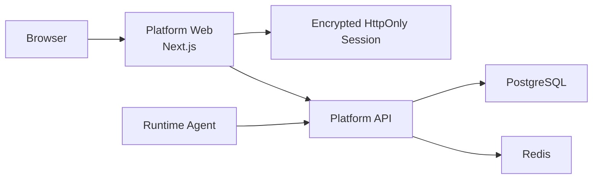
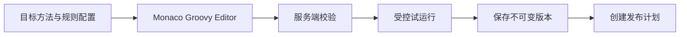

# Runtime Mock Platform Web 产品与工程设计

> 文档状态：实施基线
> 更新日期：2026-06-18
> 对应 PRD：[`../requirements/runtime-mock-product-requirements.md`](../requirements/runtime-mock-product-requirements.md)

> 实施状态：独立 Next.js 工程、同源 BFF、Token 会话、平台导航、各领域资源页、总览、
> Monaco 规则工作台、Docker 和测试骨架已落地。后端尚缺接口继续按第 12.4 节管理，
> 前端 Demo 模式只用于独立验收，不代表后端能力已经交付。

## 1. 设计结论

新增独立模块 `runtime-mock-platform-web`，作为 Runtime Mock 中央管理平台的唯一完整 Web
入口。技术栈固定为：

- Next.js App Router；
- React 19；
- TypeScript strict mode；
- Tailwind CSS；
- shadcn/ui；
- Lucide Icons；
- Monaco Editor；
- Runtime Mock 专属组件。

纪年堂项目提供 Next.js、React、Tailwind、Lucide、动效和交互实现经验，但不直接复制其
家族档案业务组件、暖色主题或页面结构。Runtime Mock 建立独立的运维工具设计语言。

## 2. 为什么独立成模块

`runtime-mock-platform-web` 满足多个真实边界：

- 与 Java 后端不同的语言、依赖和构建工具；
- 独立的 UI 设计系统、测试体系和浏览器兼容要求；
- 独立 Docker 镜像和发布节奏；
- Monaco、可视化和复杂交互形成独立工程复杂度；
- 中央平台有多个用户角色和完整信息架构；
- 可以在不重启 Platform API 的情况下发布前端修复。

该模块是独立部署单元，但不拥有业务权威数据。所有业务规则、权限、状态机和审计仍由
Platform API 决定。

## 3. 与 Agent 本地控制台的边界

| 能力 | Platform Web | Agent 本地控制台 |
| --- | --- | --- |
| 使用对象 | 多角色平台用户 | 单机诊断人员 |
| 管理范围 | 多应用、多实例、多 Agent | 当前 JVM |
| 规则版本/发布 | 完整支持 | 仅本地应急 |
| 审批/录制/提取/回放 | 后续阶段 | 不支持 |
| 审计 | 中央权威审计 | 本地事件 |
| 发布方式 | 独立 Next.js 镜像 | 嵌入 Agent JAR |
| 可用性要求 | 正式产品入口 | loopback 应急入口 |

两者不共享运行时前端包。可以共享视觉规范和 API 概念，但不能让 Agent 依赖 Node.js 或
Platform Web 才能完成本地应急操作。

## 4. 总体架构



浏览器默认只访问 Platform Web。Next.js Route Handler/BFF 将服务端会话转换为 Platform
Bearer Token 调用，避免把平台 Token 暴露给浏览器 JavaScript，并避免大范围 CORS 配置。

## 5. 渲染与运行策略

### 5.1 Next.js 使用方式

- 使用 App Router。
- Server Component 作为页面和数据读取的默认形态。
- 只有表格交互、表单、Monaco、图表、拖拽和实时状态区域使用 Client Component。
- 使用 `output: "standalone"` 构建独立 Node 容器。
- 不要求 Vercel，不依赖厂商托管能力。
- 不采用纯静态导出，因为需要服务端会话和同源 BFF。

### 5.2 数据获取

数据读取分为两类：

- 首屏和详情基础信息：在 Server Component 中通过服务端 API Client 获取。
- 高频交互和轮询：在 Client Component 中使用 TanStack Query，通过同源 BFF 请求。

缓存原则：

- 权威状态以 Platform API 为准；
- 列表默认短缓存；
- 发布、命令和任务执行状态使用短轮询；
- 写操作成功后精准失效相关 Query；
- 不在多个全局 Store 中复制服务端实体。

### 5.3 状态分类

| 状态类型 | 存放位置 |
| --- | --- |
| 筛选、分页、Tab、选中环境 | URL search params |
| Platform 业务实体 | Server Component / TanStack Query cache |
| 当前用户和权限 | 服务端会话 + `/auth/me` |
| 未保存表单和编辑器内容 | React local state / form state |
| 跨页面 UI 偏好 | Cookie 或受控 localStorage，不含敏感数据 |
| Token、密码、脚本样本敏感字段 | 仅服务端或当前内存，不持久化到浏览器存储 |

## 6. 前端工程结构

```text
runtime-mock-platform-web/
├── app/
│   ├── (auth)/
│   │   └── login/
│   ├── (platform)/
│   │   ├── overview/
│   │   ├── applications/
│   │   ├── agents/
│   │   ├── rules/
│   │   ├── rollouts/
│   │   ├── audits/
│   │   └── settings/
│   └── api/
│       ├── auth/session/
│       └── platform/[...path]/
├── components/
│   ├── ui/
│   ├── layout/
│   ├── data-display/
│   ├── feedback/
│   └── editor/
├── features/
│   ├── agents/
│   ├── rules/
│   ├── rollouts/
│   └── audits/
├── lib/
│   ├── api/
│   ├── auth/
│   ├── permissions/
│   ├── telemetry/
│   └── utils/
├── styles/
│   └── tokens.css
├── tests/
│   ├── unit/
│   └── e2e/
├── components.json
├── next.config.ts
├── package.json
└── Dockerfile
```

规则：

- `components/ui` 保存经过定制的 shadcn/ui 基础组件源码。
- `features` 按业务能力组织，不创建按页面名称重复的“万能组件”。
- API 生成代码与业务 ViewModel 分离。
- 页面只做组合，不直接包含大段请求、权限和数据转换逻辑。

## 7. 设计系统

### 7.1 基础原则

- 专业、克制、可靠，避免消费产品式装饰。
- 默认高信息密度，但保留舒适/紧凑两档。
- 状态颜色同时配合文字和图标，不只依赖颜色。
- 危险操作在空间、颜色和文案上与普通主按钮区分。
- 代码、ID、哈希、类名和方法签名统一使用等宽字体。

### 7.2 Token

设计 Token 由 CSS variables 定义，并映射到 Tailwind：

```text
color:
  background / surface / elevated / muted
  foreground / secondary / disabled
  border / focus
  primary / success / warning / danger / info

space:
  1 / 2 / 3 / 4 / 6 / 8 / 12

radius:
  sm / md / lg

shadow:
  sm / md / overlay

typography:
  sans / mono
  xs / sm / base / lg / xl / 2xl
```

不直接复制纪年堂的 `#f7f2ea`、`#263f3a` 等业务配色。可以复用其清晰层级、柔和阴影和
动效节奏的设计经验。

### 7.3 shadcn/ui 使用原则

shadcn/ui 是源码组件方案，不作为不可修改的黑盒依赖。首批引入：

- Button、Input、Textarea、Select、Checkbox、Switch；
- Form、Label、Popover、Tooltip；
- Dialog、AlertDialog、Drawer、Sheet；
- Table、Tabs、Badge、Card、Separator；
- DropdownMenu、Command、Breadcrumb；
- Toast/Sonner、Alert、Skeleton、Progress；
- Calendar、Date Picker；
- Resizable Panel。

所有组件必须统一：

- focus ring；
- disabled/loading 状态；
- 键盘行为；
- 中文文案；
- 尺寸和密度；
- 危险操作样式。

### 7.4 Runtime Mock 专属组件

| 组件 | 作用 |
| --- | --- |
| `StatusBadge` | Agent、任务和发布状态 |
| `ResourceScopePicker` | 应用/环境/实例/Agent 范围选择 |
| `MethodSignature` | 类名、方法、参数和返回值展示 |
| `RuleTypeBadge` | BEFORE/RETURN/THROWS |
| `RiskBanner` | 风险级别、影响范围和恢复说明 |
| `OperationTimeline` | 发布和任务状态时间线 |
| `AgentHealthCard` | 心跳、版本、JVM 和规则概况 |
| `JsonDiffViewer` | JSON 树和字段级差异 |
| `AuditChainStatus` | 审计哈希链状态 |
| `RequestErrorPanel` | request ID、错误码、重试和诊断信息 |
| `ConfirmOperationDialog` | 目标、影响、原因和确认词 |

## 8. 页面布局

### 8.1 应用框架

- 左侧导航：领域入口，可折叠。
- 顶部栏：环境、搜索、命令面板、失败任务提醒、用户菜单。
- 页面标题区：标题、说明、状态和主操作。
- 主内容区：列表、工作台或详情。
- 右侧详情抽屉：适合快速查看，不替代可链接的正式详情页。

### 8.2 列表页

列表页统一提供：

- 关键字、状态、时间和领域筛选；
- URL 可分享的筛选和分页；
- 列显示和密度设置；
- 批量操作；
- 空状态、错误状态和 Skeleton；
- 行内快捷操作与详情跳转；
- 服务端分页和排序。

### 8.3 详情页

详情页采用：

- 顶部身份与状态摘要；
- Overview、Versions/Executions、Events、Audit 等 Tab；
- 右侧关键元数据；
- 危险操作集中在独立区域；
- 所有状态和版本都可复制链接。

### 8.4 总览页优化清单

- 重新设计“故障注入运行闭环”模块，避免只重复工作流入口。
- 模块应直接回答当前注入是否可控：目标健康、规则状态、发布执行、恢复状态。
- 每个闭环信号需要展示状态值、关键上下文和下一步动作，不只提供跳转入口。
- 在后端缺少真实状态聚合前，不在总览页占用大面积展示区域；可先降级为状态条或放入详情页。

### 8.5 长期平台诊断清单

- 将“基础服务健康度”从首页总览移出，后续作为平台诊断能力统一设计。
- 平台诊断页应覆盖 Platform API、Web BFF、PostgreSQL、Redis、调度器和 Agent 心跳聚合。
- 诊断能力必须基于真实探测结果展示状态、延迟、最近检查时间和故障上下文，不在前端硬编码健康项。
- 首页仅保留与故障注入操作闭环直接相关的状态，避免把平台基础设施监控作为主要内容。

## 9. 规则编辑工作台

规则编辑是产品核心，不按普通表单设计。



### 9.1 布局

- 左侧：按“基础信息 → 目标方法 → 执行策略”渐进展开，应用和环境来自已接入实例，
  目标方法优先从当前应用和环境已经登记的目标中搜索，也允许用户明确切换为手动输入。
- 中间：Monaco Editor。
- 右侧：上下文文档、诊断、模板和变量。
- 底部：试运行输入、输出、日志和 Diff。
- 面板使用 Resizable Panel，支持专注模式。

新建规则不得自动填充订单、支付等示例业务数据。初始脚本只提供
`return mock.proceed()` 安全骨架；规则名称、应用、环境、目标方法和执行阶段未完成前，
编辑器保持引导状态，校验、试运行和保存按钮禁用。右侧诊断区和底部试运行区在新建时默认
收起，仅在用户主动展开或执行相应操作时显示。示例规则只能通过用户主动选择模板进入，
不得伪装成生产配置。

### 9.2 Monaco 集成

Monaco 动态加载，避免影响普通页面首屏。Groovy 支持通过以下组合实现：

- Monarch tokenizer 提供语法高亮；
- Completion Provider 提供 Runtime Mock 变量、方法和代码片段；
- Hover Provider 提供类型和使用说明；
- Marker API 展示服务端返回的行列诊断；
- Diff Editor 展示历史版本差异；
- Model URI 按规则和版本稳定命名，避免多个编辑器互相污染；
- Worker 路径由 Next.js 构建配置显式处理。

浏览器端高亮和补全只改善体验，服务端校验才是保存和发布依据。

### 9.3 编辑保护

- 自动保存到当前浏览器内存草稿，不持久化敏感样本；
- 离开页面和关闭标签前提示未保存变更；
- 保存时使用版本号或 ETag 处理并发更新；
- 服务端返回新版本后再清除 dirty 状态；
- 网络失败保留编辑内容并提供复制/下载草稿；
- 历史版本只读，修改时创建新版本。

### 9.4 校验与试运行

建议接口：

```text
POST /api/v1/scripts/validate
POST /api/v1/scripts/preview
POST /api/v1/scripts/test
```

请求包含脚本、规则类型、目标签名和受控输入；响应包含：

- diagnostics：级别、代码、消息、行、列；
- compile result；
- security policy result；
- output 或 exception；
- execution duration；
- logs summary；
- before/after object diff；
- request ID。

后端必须实施超时、大小、循环/调用、安全策略和隔离限制。

## 10. 认证与会话设计

### 10.1 当前 Token 模式

当前 Platform 使用 opaque Bearer Token。Web 登录页允许用户输入 Token，但提交后：

1. Token 只发送到 Next.js 服务端；
2. 服务端调用 `/api/v1/auth/me` 校验；
3. Token 使用 Web Session Key 加密后进入 HttpOnly、Secure、SameSite Cookie；
4. 浏览器 JavaScript 只能看到当前用户摘要，不能读取 Token；
5. BFF 请求在服务端解密并附加 Authorization；
6. 退出时销毁会话 Cookie。

Cookie 必须设置合理 Max-Age，且不得超过 Token 到期时间。

### 10.2 安全控制

- 所有写请求验证 Origin/Host，并实施 CSRF 防护；
- CSP 禁止任意脚本执行；
- 禁止 Token 进入 URL、localStorage、日志和监控；
- 页面错误上报过滤脚本正文、样本和凭据；
- 前端权限只控制体验，后端必须再次鉴权；
- 401 清理会话并跳转登录；
- 403 保留页面上下文并说明缺失权限。

### 10.3 未来 OIDC

未来 OIDC 只替换登录和会话建立流程。页面权限、业务 API Client 和 RBAC ViewModel 不应
依赖具体身份提供商。

## 11. API Client 与契约

### 11.1 OpenAPI 优先

- `docs/api/platform-openapi.yaml` 是前端类型来源。
- 使用 `openapi-typescript` 生成类型。
- 使用轻量 typed fetch client 或生成的封装调用。
- CI 比较生成结果，发现契约漂移即失败。
- 不允许手写与 OpenAPI 重复的请求/响应 DTO。

### 11.2 统一请求模型

所有请求封装：

- Authorization；
- request ID / correlation ID；
- 幂等键；
- 超时和取消；
- 标准错误解析；
- 401/403 处理；
- 可安全记录的性能指标。

标准错误 ViewModel：

```ts
type PlatformError = {
  code: string;
  message: string;
  requestId?: string;
  fieldErrors?: Record<string, string[]>;
  retryable: boolean;
};
```

### 11.3 API 缺口

实施 Platform Web 前必须补齐或明确以下接口：

- 当前主体 `/auth/me`；
- 规则详情、版本详情和版本列表；
- 脚本 validate/preview/test；
- 类和方法搜索；
- Dashboard 聚合；
- 通用分页、排序和过滤；
- 发布和任务层级详情；
- 批量操作和幂等语义。

## 12. 表单、权限与状态机

### 12.1 表单

推荐 React Hook Form + Zod：

- Zod 表达前端即时校验；
- 服务端字段错误映射回对应控件；
- 提交期间禁用重复请求；
- 敏感输入默认不回显；
- 大型配置表单分区保存或提供离开确认。

### 12.2 权限

权限工具至少支持：

```text
can(action, resource)
canAny(...)
requirePermission(...)
```

按钮、菜单、路由和字段按权限调整，但 API 403 仍需正常处理。禁止把角色名称直接散落在组件中。

### 12.3 状态机

发布流程使用后端返回的：

- current status；
- allowed actions；
- version；
- transition reason。

前端不得自行推导并强行执行非法状态转换。

## 13. 反馈与错误恢复

### 13.1 页面状态

每个数据区域必须实现：

- loading；
- empty；
- success；
- stale；
- partial error；
- blocking error。

### 13.2 写操作反馈

- Toast 用于轻量成功通知；
- 持续任务进入全局任务中心；
- 失败信息保留在当前上下文；
- 可重试操作明确展示“重试”；
- 高风险操作返回可复制的 request ID；
- 乐观更新仅用于容易撤销且冲突风险低的动作。

## 14. 性能设计

- Monaco、Diff Editor、图表和 React Flow 按路由动态加载。
- 大表格采用服务端分页，必要时使用虚拟化。
- 图表只请求聚合数据，不把全部明细传到浏览器计算。
- 使用 Next.js bundle analyzer 控制依赖体积。
- Lucide 图标按名称静态导入，避免打包整个图标集。
- 避免把大型 JSON 通过 Server Component 序列化到客户端。
- 列表轮询在页面不可见时暂停。

## 15. 可访问性

- shadcn/Radix 组件保留正确语义和键盘行为；
- 所有表单有可见 Label 和错误关联；
- Dialog 打开后管理焦点，关闭后恢复焦点；
- 状态不只依赖颜色；
- Monaco 外提供诊断列表和快捷键说明；
- 动效尊重 `prefers-reduced-motion`；
- 核心页面按 WCAG 2.1 AA 检查。

## 16. 测试策略

### 16.1 单元与组件测试

使用 Vitest 和 Testing Library 覆盖：

- 权限判断；
- 状态映射；
- API 错误转换；
- 表单校验；
- 专属组件；
- 编辑器诊断映射；
- Diff 和格式化工具。

### 16.2 端到端测试

使用 Playwright 覆盖：

1. Token 登录和退出；
2. 无权限访问；
3. Agent 查询；
4. 规则编辑、校验、测试和保存版本；
5. 创建发布和查看结果；
6. Token 过期、接口失败和网络恢复。

### 16.3 视觉回归

对应用框架、规则编辑器、发布详情、比较视图、Dialog 和错误状态建立截图基线。

## 17. 构建与部署

### 17.1 环境变量

```text
RUNTIME_MOCK_PLATFORM_API_URL=http://runtime-mock-platform-api:18280
RUNTIME_MOCK_WEB_SESSION_KEY=<32-byte-or-stronger-secret>
RUNTIME_MOCK_WEB_PUBLIC_BASE_URL=http://localhost:18380
RUNTIME_MOCK_WEB_ENVIRONMENT=local
```

服务端 API URL 不暴露为浏览器公共变量。公开变量不得包含凭据。

### 17.2 容器

采用多阶段构建：

1. 安装锁定依赖；
2. 类型检查、测试和 `next build`；
3. 复制 standalone、static 和 public；
4. 使用非 root 用户运行；
5. 提供健康检查。

### 17.3 Compose

新增 `platform-web` 服务：

- 依赖 Platform API 健康；
- 默认暴露 `18380`；
- 通过内部网络访问 API；
- 不直接访问 PostgreSQL 或 Redis；
- 会话密钥通过环境或 secrets 注入。

## 18. CI 质量门

前端流水线必须执行：

```text
npm ci
npm run typecheck
npm run lint
npm run test
npm run build
npm run test:e2e
```

同时检查：

- lockfile 未漂移；
- OpenAPI 生成代码未漂移；
- 无高危依赖漏洞；
- bundle 未超过约定预算；
- Docker 镜像可启动且健康检查通过。

## 19. 实施顺序

### 阶段 1：工程与设计系统

- 初始化 Next.js/React 19/TypeScript/Tailwind；
- 建立 Token、shadcn/ui 和应用框架；
- 实现会话、API Client、权限和错误模型；
- 接入单元测试、Playwright 和 Docker。

### 阶段 2：核心控制闭环

- 总览；
- Agent；
- 规则中心和 Monaco 工作台；
- 版本 Diff；
- 发布和审计。

### 阶段 3：治理与数据工作流

- 审批工作流；
- 录制与数据集；
- 数据提取；
- 回放与比较；
- Worker 产物和任务中心。

### 阶段 4：体验与生产加固

- 性能、无障碍、视觉回归；
- 错误恢复和可观测性；
- OIDC/云适配入口预留；
- 真实用户反馈迭代。

## 20. 架构决策记录

| 决策 | 结论 |
| --- | --- |
| React 还是 Vue | 采用 React 19，复用已有 Next.js 经验 |
| Next.js 还是纯 Vite SPA | 采用 Next.js，使用服务端会话和 BFF |
| UI 组件库 | Tailwind + shadcn/ui 源码组件 |
| 图标 | Lucide |
| 代码编辑器 | Monaco Editor |
| 微前端 | 当前不采用 |
| Agent 控制台是否合并 | 不合并，保持轻量应急入口 |
| Token 是否存 localStorage | 禁止 |
| Groovy 是否浏览器执行 | 禁止，服务端受控执行 |
| 实时通信 | 首期短轮询，按需求评估 SSE |
