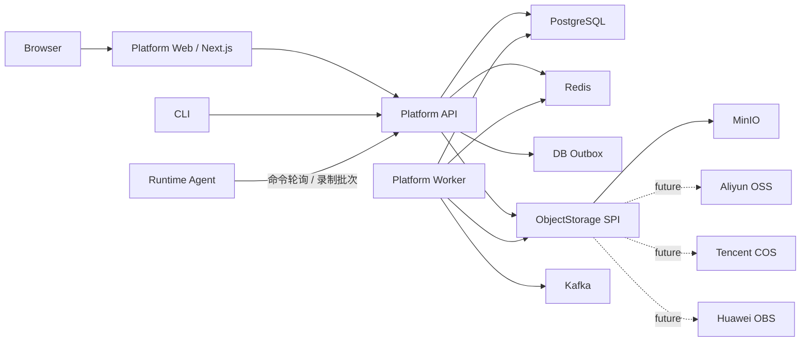

# Runtime Mock 简化平台架构

## 1. 决策摘要

Runtime Mock 采用“独立 Platform Web + 模块化控制面 + 独立异步 Worker + JVM Agent”的结构。项目保留
PostgreSQL、Redis、Kafka 和兼容 S3 的对象存储，但不把 Kubernetes、企业 SSO、
Vault 或云 KMS 设为运行前提。

这是当前已经实现并完成联调的架构。Platform API、Worker、Agent 和独立的
`runtime-mock-platform-web` 前端工程共同构成产品运行面；脚本校验与试运行、详情查询、
聚合仪表盘、统一分页查询和录制事件查询均由真实 Platform API 提供。

目标不是削弱生产安全，而是把必须能力与可选企业集成分开：

- 必须：可靠状态、权限、审计、异步任务、对象存储、数据加密和 Agent 身份。
- 可选：Kubernetes、OIDC/企业 SSO、云 KMS、多云对象存储适配器。

## 2. 运行拓扑



默认后端部署包含两个平台进程，但使用同一个构建产物：

- API 角色：HTTP API、认证、RBAC、审批、规则和发布状态管理。
- Worker 角色：Rollout、Extraction、Replay、Outbox 发布和对象写入。

这样可以独立扩缩容和隔离故障，又不引入微服务间 RPC、服务发现和 Kubernetes。

Platform Web 使用独立 Next.js 镜像，通过同源 BFF 访问 Platform API。它具有独立前端
技术栈、交互复杂度和发布边界，但不拥有业务权威数据。

## 3. 基础设施职责

### PostgreSQL

只保存需要持久化和强一致的权威状态：

- 用户、角色、资源范围和访问令牌元数据；
- Agent、规则、版本、发布计划、审批和任务状态；
- 幂等记录、审计哈希链和 Outbox；
- 对象 URI、哈希、大小、加密元数据。

PostgreSQL 不保存大型录制内容，也不作为通用消息队列。

### Redis

保存可重建或短生命周期的协调数据：

- fencing sequence；
- 限流、短期缓存和在线状态；
- 后续可加入访问令牌验证缓存。

Redis 丢失不应导致权威业务数据丢失。

### Kafka

承载数据库事务提交后的异步事件：

- 状态变化事件；
- 审计和通知事件；
- 后续录制数据流与跨服务消费。

平台使用 Transactional Outbox 保证数据库状态先提交，再由 Worker 至少一次发布。

### MinIO / 对象存储

保存所有大对象：

- Extraction 结果；
- Replay 输入、输出和摘要；
- Dataset、录制分片与 WAL 上传对象；
- 审计导出文件。

业务代码只依赖 `runtime-mock-storage-spi`。MinIO 是首个实现，云厂商 SDK 通过独立适配器
接入，业务表统一保存 provider、bucket、objectKey、versionId、SHA-256 和加密元数据。

### 录制数据流

录制会话进入 `RECORDING` 后，Platform 自动向目标 Agent 下发 `START_RECORDING`。Agent
通过 Byte Buddy 调用观察器采集方法入参、返回值或异常，写入有界内存队列并批量上传；
Platform 对批次执行身份校验、会话状态校验、大小/配额限制和脱敏，再使用随机 DEK +
AES-256-GCM 加密写入 MinIO，同时只在 PostgreSQL 保存批次、事件索引、哈希和对象引用。
停止或失败会话会下发 `STOP_RECORDING`。该路径不要求部署独立 Sidecar 进程。

## 4. 认证设计

当前阶段不实现完整 OAuth 2.0 Authorization Server，也不依赖 Keycloak。

平台使用随机 256-bit opaque Bearer Token：

- 数据库只保存 SHA-256 哈希，不保存明文 Token；
- Token 绑定 `USER` 或 `AGENT` 主体；
- 支持有效期、撤销、最后使用时间和审计；
- 明文只在创建时返回一次；
- `header-dev` 只用于显式启用的 loopback 测试环境。

首次启动通过 `RUNTIME_MOCK_BOOTSTRAP_TOKEN` 注入管理员 Token。管理员随后通过
`/api/v1/auth/tokens` 为用户或 Agent 签发独立 Token。

未来接入 OIDC 时，应新增身份提供器适配器，不修改 RBAC 与业务服务。

## 5. 密钥与对象加密

当前阶段采用本地 KEK + 随机 DEK 的信封加密：

1. 每个对象生成随机 256-bit DEK；
2. 使用 AES-256-GCM 加密对象内容；
3. 使用本地 Master KEK 包装 DEK；
4. 密文写入 MinIO；
5. wrapped DEK、nonce、KEK version 和作用域保存为对象元数据；
6. 内存中的 DEK 使用后清零。

Master KEK 只能从环境变量或权限受控文件加载，不能进入数据库或镜像。

`KeyEncryptionService` 是稳定边界。以后接入阿里云 KMS、腾讯云 KMS、华为云 KMS
时只替换 KEK 包装实现，不改变对象格式和业务接口。

## 6. 模块边界

模块拆分不以数量最少为目标。以下边界需要保持稳定：

- Bootstrap API、Agent Bootstrap：由 JVM 类加载隔离决定；
- Public API、Core、Groovy：分别承担公共契约、规则引擎和可替换脚本实现；
- Agent Core、Agent Server、Modern Assembly：分别承担字节码增强、运行时集成和发行打包；
- `runtime-mock-storage-spi`：云无关对象存储契约。
- `runtime-mock-storage-minio`：MinIO 适配器。
- Platform Server：模块化控制面，使用同一产物运行 API 和 Worker 两种角色。
- `runtime-mock-platform-web`：Next.js + React 19 中央管理平台，独立构建和发布。

现阶段不把平台领域代码拆成多个独立仓库。API 与 Worker 共享代码和数据库 schema，
通过运行配置决定启用的组件：

```text
RUNTIME_MOCK_API_ENABLED=true|false
RUNTIME_MOCK_WORKER_ENABLED=true|false
```

Agent 的单消费者静态资源不再独立成模块，本地控制台已经并入 Agent Server。中央管理平台
具有独立产品和工程边界，因此单独建设 `runtime-mock-platform-web`。早期内存
`control-server` 与正式 Platform 职责重复，已经删除。完整判断规则见
`module-boundary-governance.md`。

Platform Web 的页面、会话、设计系统和 Monaco 编辑器方案见
`runtime-mock-platform-web-design.md`。

## 7. 明确不做

当前阶段明确不要求：

- Kubernetes、Helm、Service Mesh；
- Keycloak、Okta 或企业 SSO；
- Vault 或云 KMS；
- WORM 合规声明；
- 多区域主动—主动；
- 为每个领域拆分独立微服务。

这些能力可以后续增加，但不得反向污染核心业务接口。
