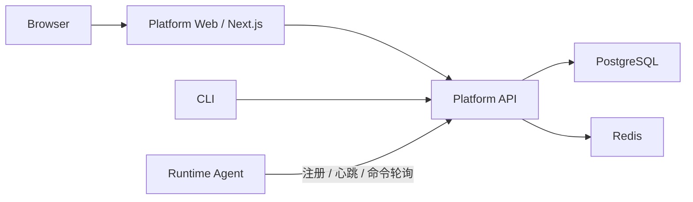

# Kairo 简化平台架构

## 1. 决策摘要

Kairo V1 采用“独立 Platform Web + 模块化控制面 + JVM Agent”的结构。项目保留
PostgreSQL 和 Redis 作为当前运行依赖，但不把 Kubernetes、企业 SSO、Vault、云 KMS、Kafka
或对象存储设为运行前提。

这是当前已经实现并完成联调的架构。Platform API、Agent 和独立的
`kairo-platform-web` 前端工程共同构成产品运行面；脚本校验与试运行、详情查询、
聚合仪表盘和统一分页查询均由真实 Platform API 提供。

目标不是削弱生产安全，而是把必须能力与可选企业集成分开：

- 必须：可靠状态、权限、审计、发布调度和 Agent 身份。
- 可选：Kubernetes、OIDC/企业 SSO、云 KMS、Kafka、对象存储和多云适配器。

## 2. 运行拓扑

默认后端部署包含一个平台进程：

- Platform API：HTTP API、认证、RBAC、规则、发布状态管理和调度器。

这样可以在不引入微服务间 RPC、服务发现和 Kubernetes 的前提下完成 V1 故障注入闭环。

Platform Web 使用独立 Next.js 镜像，通过同源 BFF 访问 Platform API。它具有独立前端
技术栈、交互复杂度和发布边界，但不拥有业务权威数据。

## 3. 基础设施职责

### PostgreSQL

只保存需要持久化和强一致的权威状态：

- 用户、角色、资源范围和访问令牌元数据；
- Agent、规则、版本、发布计划和执行状态；
- 幂等记录和审计哈希链。

PostgreSQL 不作为通用消息队列。

### Redis

保存可重建或短生命周期的协调数据：

- fencing sequence；
- 后续可加入限流、短期缓存和访问令牌验证缓存。

Redis 丢失不应导致权威业务数据丢失。

### 后续事件与对象存储

Kafka Outbox、MinIO、录制对象、数据集对象、提取产物和回放结果不属于 V1 运行依赖。
后续阶段重新启用这些能力时，应保持对象存储 SPI 与事件发布边界，不反向污染 V1 控制面。

## 4. 认证设计

当前阶段不实现完整 OAuth 2.0 Authorization Server，也不依赖 Keycloak。

平台使用随机 256-bit opaque Bearer Token：

- 数据库只保存 SHA-256 哈希，不保存明文 Token；
- Token 绑定 `USER` 或 `AGENT` 主体；
- 支持有效期、撤销、最后使用时间和审计；
- 明文只在创建时返回一次；
- `header-dev` 只用于显式启用的 loopback 测试环境。

首次启动通过 `KAIRO_BOOTSTRAP_TOKEN` 注入管理员 Token。管理员随后通过
`/api/v1/auth/tokens` 为用户或 Agent 签发独立 Token。

未来接入 OIDC 时，应新增身份提供器适配器，不修改 RBAC 与业务服务。

## 5. 密钥

V1 不处理大型对象加密。平台必须保证访问 Token 只保存哈希，Web 会话密钥由部署环境注入，
不得写入镜像、数据库、日志或前端代码。

## 6. 模块边界

模块拆分不以数量最少为目标。以下边界需要保持稳定：

- Bootstrap API、Agent Bootstrap：由 JVM 类加载隔离决定；
- Public API、Core、Groovy：分别承担公共契约、规则引擎和可替换脚本实现；
- Agent Core、Agent Server、Modern Assembly：分别承担字节码增强、运行时集成和发行打包；
- Platform Server：模块化控制面，运行 API 和 V1 调度器。
- `kairo-platform-web`：Next.js + React 19 中央管理平台，独立构建和发布。

现阶段不把平台领域代码拆成多个独立仓库。平台 API 和调度器共享代码和数据库 schema。

Agent 的单消费者静态资源不再独立成模块，本地控制台已经并入 Agent Server。中央管理平台
具有独立产品和工程边界，因此单独建设 `kairo-platform-web`。早期内存
`control-server` 与正式 Platform 职责重复，已经删除。完整判断规则见
`module-boundary-governance.md`。

Platform Web 的页面、会话、设计系统和 Monaco 编辑器方案见
`kairo-platform-web-design.md`。

## 7. 明确不做

当前阶段明确不要求：

- Kubernetes、Helm、Service Mesh；
- Keycloak、Okta 或企业 SSO；
- Vault 或云 KMS；
- WORM 合规声明；
- 多区域主动—主动；
- 为每个领域拆分独立微服务。

这些能力可以后续增加，但不得反向污染核心业务接口。
